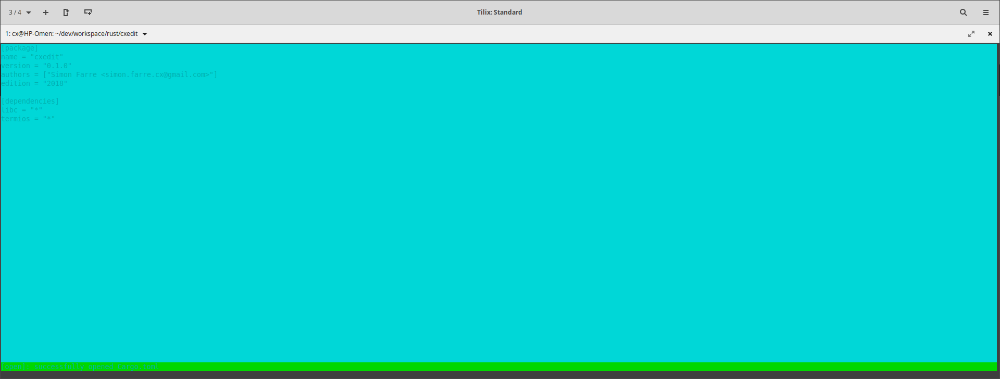
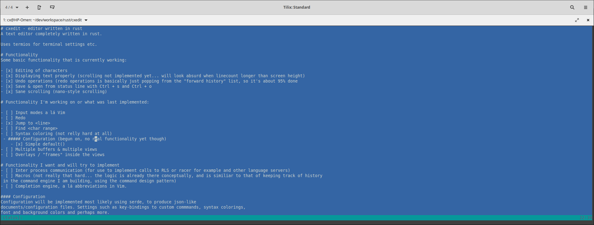
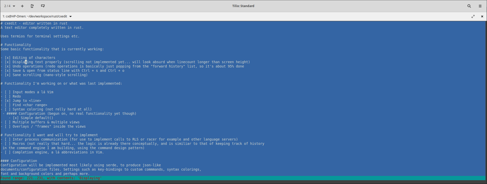
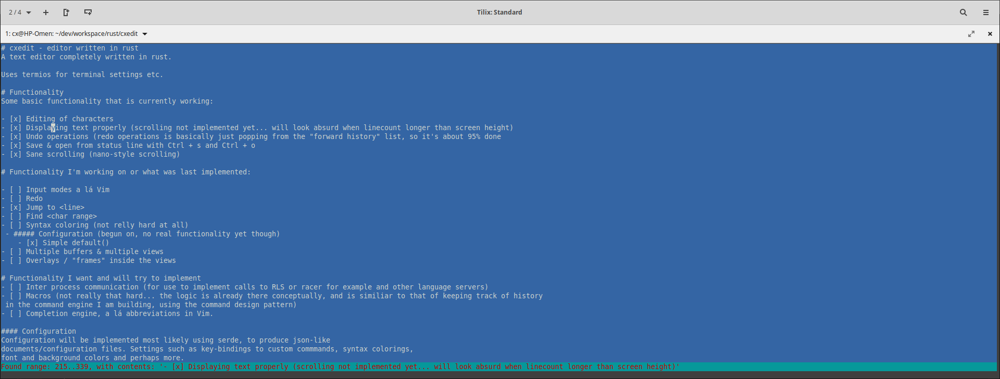

# cxedit - editor written in rust
A text editor completely written in rust.

Uses termios for terminal settings etc.

# Functionality
Some basic functionality that is currently working:

- [x] Editing of characters
- [x] Displaying text properly (scrolling not implemented yet... will look absurd when linecount longer than screen height)
- [x] Undo operations (redo operations is basically just popping from the "forward history" list, so it's about 95% done
- [x] Save & open from status line with Ctrl + s and Ctrl + o
- [x] Sane scrolling (nano-style scrolling)    

# Functionality I'm working on or what was last implemented:

- [ ] Input modes a lá Vim
- [ ] 
- [ ] Redo
- [x] Jump to <line>
- [ ] Find <char range>
- [ ] Syntax coloring (not relly hard at all)
 - ##### Configuration (begun on, no real functionality yet though)
    - [x] Simple default() 
- [ ] Multiple buffers & multiple views
- [ ] Overlays / "frames" inside the views

# Functionality I want and will try to implement
- [ ] Inter process communication (for use to implement calls to RLS or racer for example and other language servers)
- [ ] Macros (not really that hard... the logic is already there conceptually, and is similiar to that of keeping track of history
 in the command engine I am building, using the command design pattern)
- [ ] Completion engine, a lá abbreviations in Vim.

#### Configuration
Configuration will be implemented most likely using serde, to produce json-like 
documents/configuration files. Settings such as key-bindings to custom commmands, syntax colorings,
font and background colors and perhaps more. 

#### IPC
For use with RLS & racer, or for example some cpp language server. This is not all though, 
a sweet IPC module could provide for addons to other small applications, if I define a clear protocol
for how data should be passed over the pipe (if a pipe is to be used, seems most sane, dbus seems... 
way too unneccesarily complex for this task. But, as with all things me, let's do it as hard as possible
so I can pat my own back. Good boy.) writing addons can be done in any language. Sure,
writing my own interpreter and adding lua or something is nice i suppose, but if I wanted that,
I would just use someone else's texteditor. I much rather write the modules as standalone programs in rust
or c++. For example, one could write a simple minigrep module, that greps a pattern of all source files
of choice in a folder and it's subfolders, passes the results to cxedit, whereby one could navigate immediately
to that file by opening it and setting the line position there. If this is done this way,
that complexity and handling of files I'm not even editing (just to grep something), is completely skipped.
Which is a bonus. A text editor edits text. I suppose. 

How to open Cargo.toml form root folder:
```bash
    cargo run -- Cargo.toml
```
or
```bash
    ./target/debug/cxedit Cargo.toml
```



### Other stuff
Emacs like input modes, like, pressing C-w C-w would do one thing, while C-w will do another. This can now be tested
If you hover the cursor over a word or on a word boundary, and hit Ctrl+w, cxedit will copy that word. If you 
immediately after (or at least do not press anything else other than) press ctrl w again, cxedit will copy the 
entire line instead.

Here's the resut of what the debug display result of Ctrl+w Ctrl+w means:
 

Test

